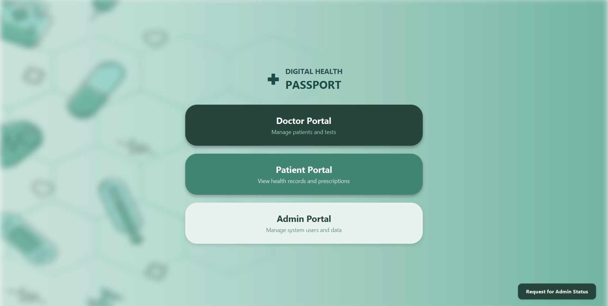
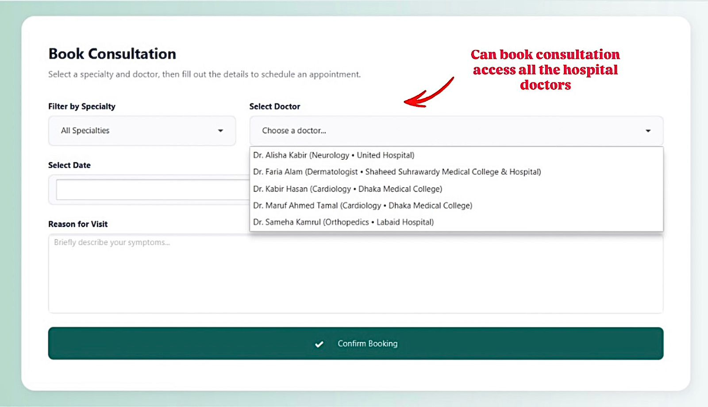
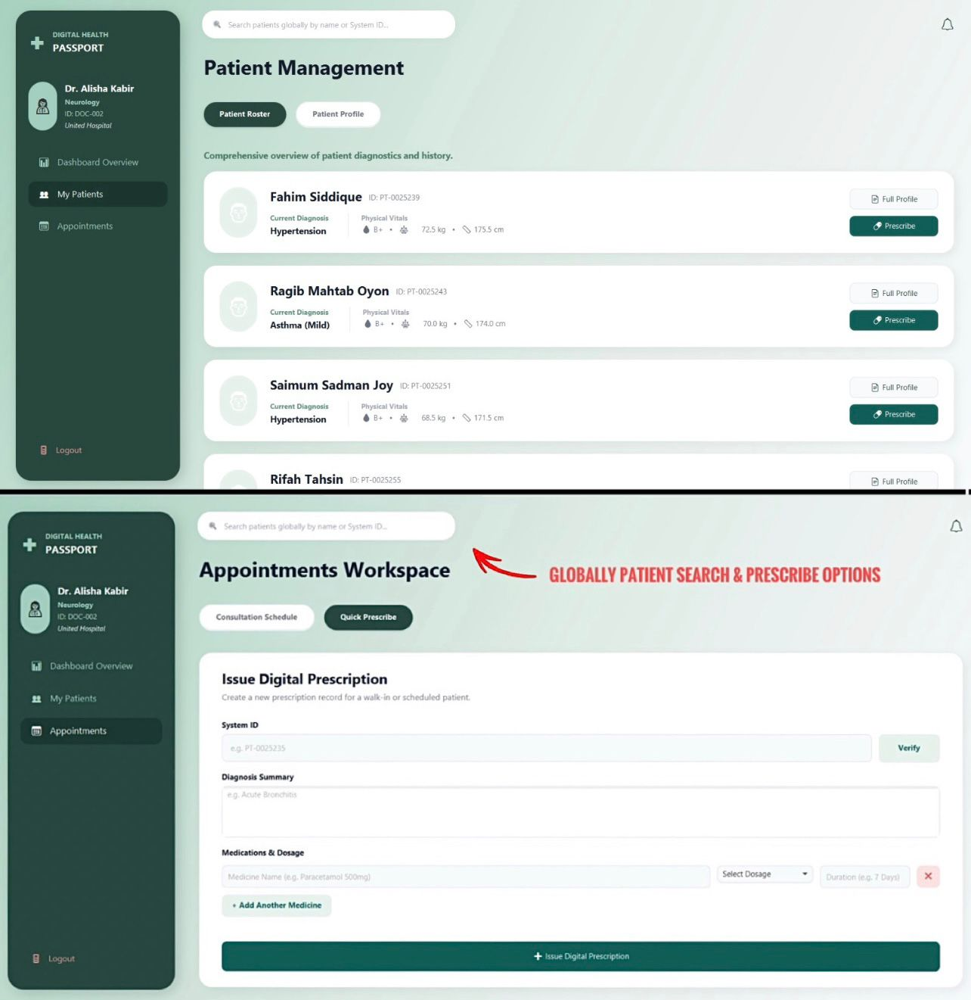
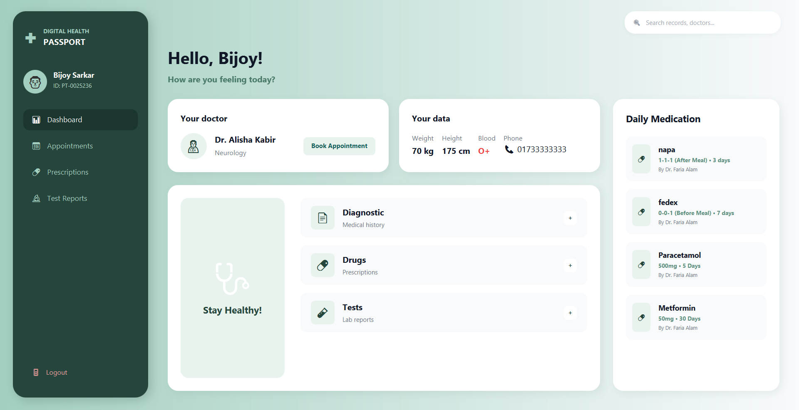
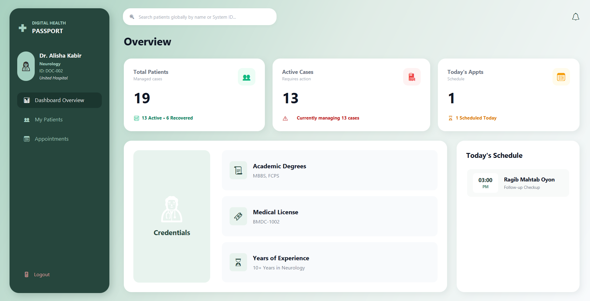
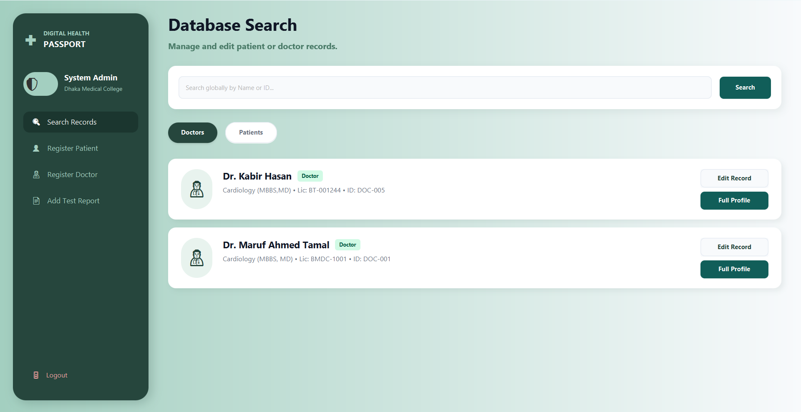
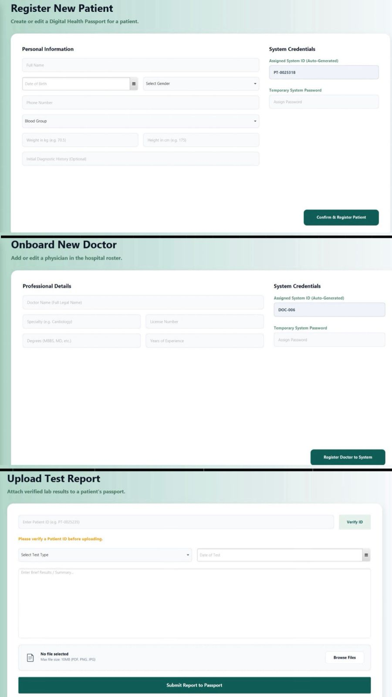
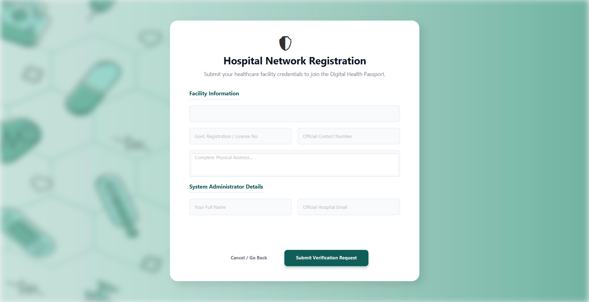

# Digital Health Passport 🏥

Digital Health Passport is a secure, centralized healthcare management system built with Java. Utilizing strict Object-Oriented Programming (OOP) methodologies and a relational SQL database, the platform eliminates institutional data silos. By maintaining a global patient registry, it empowers healthcare providers with instant access to comprehensive medical histories, enabling uninterrupted continuity of care across the entire network.



---

## 🚀 Key Architectural Features

Unlike traditional healthcare systems where patient data is trapped within a single hospital's database, this application uses a hybrid global-local architecture:

* **🌐 Global Patient Database:** Patient registration, medical histories, and test reports are completely global. Any registered doctor or administrator can securely access or update records across the entire ecosystem.


* **🏥 Localized Facility Control:** While patient data is global, doctor directories remain institutional. Individual hospital administrators manage their own local staff directories securely.

* **⚡ Absolute Patient Autonomy:** Patients can book consultations with any doctor across the entire network, completely eliminating hospital boundaries.



* **🩺 Unrestricted Continuity of Care:** Doctors can instantly view the full medical details, test reports, and histories of *any* patient in the system, even if the patient has never visited their specific hospital before.



---

## 🛠️ Core Workspaces

### 1. Patient Portal

* **Real-Time Vitals Tracking:** Displays critical real-time physical metrics including height, weight, and blood group.
* **Global Access & History:** Centralizes systemic medical history details, diagnostic data, and chronological laboratory reports.
* **Network-Wide Booking:** Allows patients to view credentials and request appointments with any specialized doctor in the network, regardless of hospital boundaries.
* **Daily Medication Hub:** Provides a scannable schedule of current prescription drugs, exact dosages, and physician directives.

### 2. Doctor Portal

* **Operational Overview:** Tracks high-level workload statistics such as total active cases, recovered histories, and current pending appointments.
* **Verified Credentials:** Showcases the physician's verified academic degrees, professional licenses, and specialized years of clinical experience.
* **Global Patient Search:** Enables direct lookups of any user profile across the universal directory to assess previous histories, existing conditions, or historical lab metrics.
* **Daily Consultation Schedule:** Keeps track of exact timeslots and checkup reasons for scheduled patients.

### 3. Admin / Hospital Portal

* **Global Database Management:** Search records and register new patient files universally onto the global registry stack.
* **Institutional Directory Control:** Manage localized facility staff by onboarding and updating verified doctors to that specific hospital's structural roster.
* **Data Appending Utilities:** Secure entry pathways allowing administrators to authoritative add official laboratory test files and update historical patient profiles.



### 4. Network Scalability & Registration

* **Verified Onboarding:** Secure gateway for outside healthcare institutions to input facility details, operational license keys, and localized administrative identities.
* **Queued Expansion Request:** Automated network routing that queues facility applications for verified administrative clearance before deploying local system privileges.

---

## 💻 Tech Stack & Architecture

* **Language:** Java
* **Build Tool:** Maven (`pom.xml`)
* **Data Persistence:** Structured JSON-based storage tracking relational data mapping across global patients and local hospital directories.
* **Development Environment:** IntelliJ IDEA

---

## ⚙️ Installation & Setup

### Prerequisites
* Java Development Kit (JDK) 8 or higher
* Apache Maven

### Running the Application Locally
1. Clone the repository:
```bash
   git clone [https://github.com/BijoySarkar11/DigitalHealthPassport.git](https://github.com/BijoySarkar11/DigitalHealthPassport.git)
Navigate to the project directory:

Bash
   cd DigitalHealthPassport
Build the project using Maven:

Bash
   mvn clean install
Run the application:

Bash
   mvn exec:java -Dexec.mainClass="your.package.name.Main"
📄 License
This project is licensed under the GNU General Public License v3.0 (GPL-3.0).

Notice: Under this copyleft license, permissions are granted for viewing, modifying, and interacting with the source code. However, any derivative works or modified versions must legally remain open-source under the same license, protecting the original architecture and authorship of this project from proprietary or closed-source reuse.
